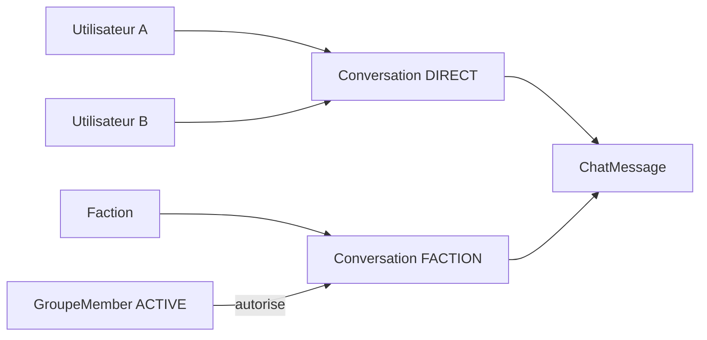

# Messagerie directe et de faction

Les conversations directes et de faction partagent `Conversation`, `ConversationParticipant` et `ChatMessage`.

## Modèle

- `DIRECT` : `groupe_id` nul, clé canonique triée des deux UUID. La création A↔B est idempotente et une conversation avec soi-même est interdite.
- `FACTION` : une conversation principale maximum par faction active.
- Pour un direct, deux `ConversationParticipant` donnent l’accès. Pour une faction, `GroupeMember ACTIVE` reste la source de vérité ; le participant ne conserve que lecture et préférences.
- `ChatMessage` contient 1 à 2000 caractères. Édition et suppression logique conservent auteur et date. L’API masque le texte d’un message supprimé.

## API et pagination

- `GET /api/conversations`
- `POST /api/conversations/direct`
- `GET /api/conversations/{id}`
- `GET|POST /api/conversations/{id}/messages`
- `PATCH|DELETE /api/conversations/{conversationId}/messages/{messageId}`
- `POST /api/conversations/{id}/read`
- `GET /api/conversations/unread-count`

Les messages sont triés par `(created_at DESC, id DESC)` et paginés par curseur, sans OFFSET profond. La réponse contient `items`, `nextCursor` et `limit`. Les compteurs excluent les propres messages de l’utilisateur.

## Sécurité, notifications et temps réel

Chaque lecture et mutation appelle `ConversationAccessService`. Un membre exclu perd immédiatement l’accès à la conversation de faction, même s’il connaît son UUID. Seul l’auteur modifie son message ; l’auteur, un responsable de faction ou un modérateur global peut le supprimer. La modération écrit uniquement les identifiants dans `AuditLog`, jamais le contenu privé. L’envoi est limité à 20 messages par minute et par utilisateur.

Une notification directe non lue est regroupée par conversation. Aucune notification persistante n’est créée pour chaque message de faction. Mercure n’étant pas installé, `ChatEventPublisherInterface` utilise `NullChatEventPublisher`; le client interroge la conversation ouverte toutes les huit secondes et suspend ce polling lorsque l’onglet est masqué.

Le système `Report` actuel possède une FK obligatoire vers `Publication`. Le rendre polymorphe pour `CHAT_MESSAGE` exige une migration et une adaptation complète de la modération ; cet incrément est volontairement reporté pour ne pas casser les signalements de publications.
