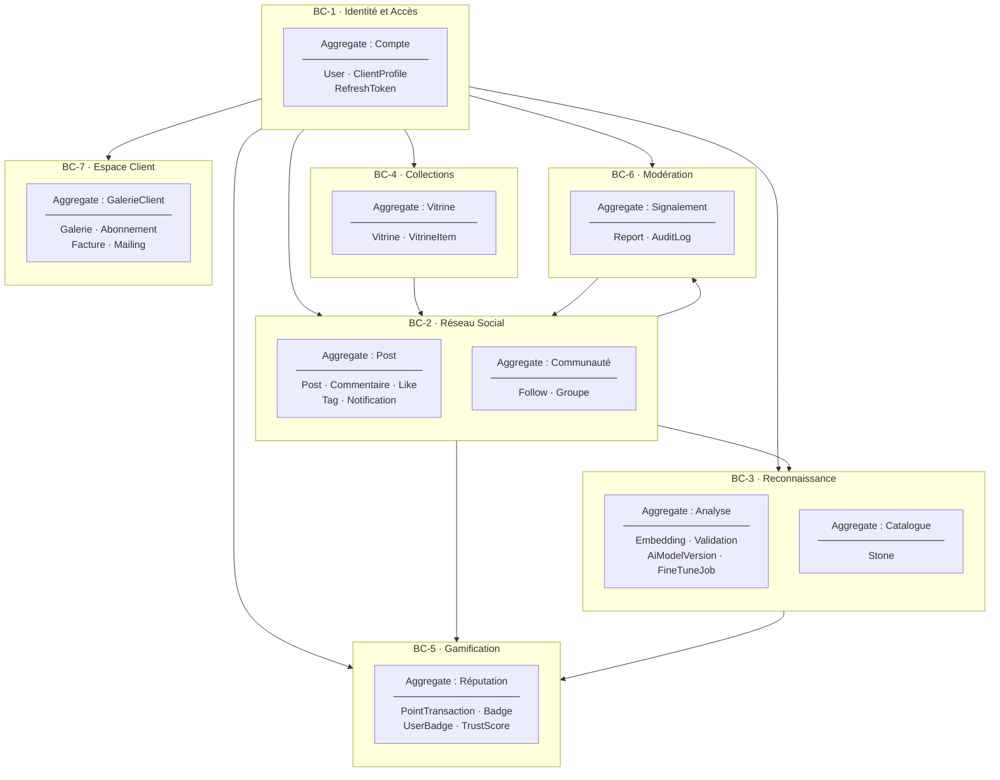
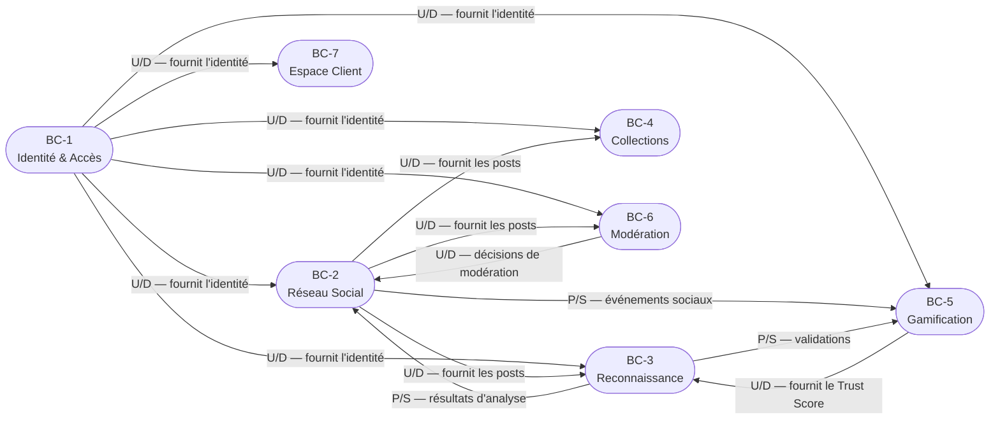
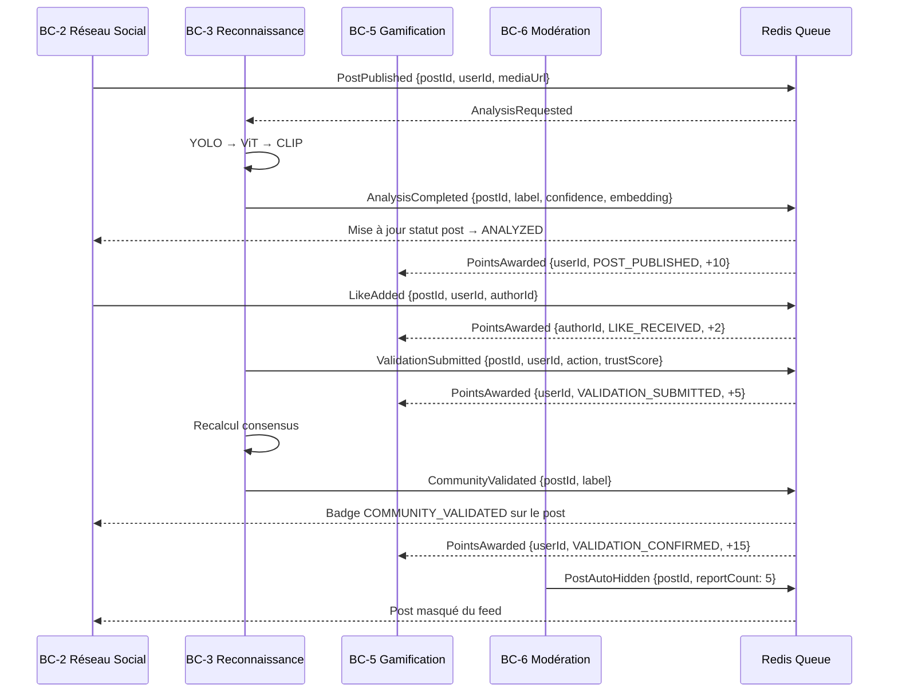

# Domaine Métier — GemLink

> **Approche :** Domain-Driven Design (DDD)  
> **Outil de rendu :** GitHub, et [Mermaid Live](https://mermaid.live)

---

## Table des matières

- [Domaine Métier — GemLink](#domaine-métier--gemlink)
  - [Table des matières](#table-des-matières)
  - [1. Vue d'ensemble du domaine](#1-vue-densemble-du-domaine)
    - [Acteurs du domaine](#acteurs-du-domaine)
  - [2. Contextes délimités (Bounded Contexts)](#2-contextes-délimités-bounded-contexts)
  - [3. Carte de contexte (Context Map)](#3-carte-de-contexte-context-map)
  - [4. Détail de chaque Bounded Context](#4-détail-de-chaque-bounded-context)
    - [BC-1 — Identité et Accès](#bc-1--identité-et-accès)
      - [Agrégat : `Compte`](#agrégat--compte)
      - [Règles métier du contexte](#règles-métier-du-contexte)
    - [BC-2 — Réseau Social](#bc-2--réseau-social)
      - [Agrégat : `Post`](#agrégat--post)
      - [Agrégat : `Communauté`](#agrégat--communauté)
      - [Règles métier du contexte](#règles-métier-du-contexte-1)
    - [BC-3 — Reconnaissance](#bc-3--reconnaissance)
      - [Agrégat : `Analyse`](#agrégat--analyse)
      - [Agrégat : `Catalogue`](#agrégat--catalogue)
      - [Agrégat : `ModèleIA`](#agrégat--modèleia)
      - [Règles métier du contexte](#règles-métier-du-contexte-2)
    - [BC-4 — Collections](#bc-4--collections)
      - [Agrégat : `Vitrine`](#agrégat--vitrine)
      - [Règles métier du contexte](#règles-métier-du-contexte-3)
    - [BC-5 — Gamification](#bc-5--gamification)
      - [Agrégat : `Réputation`](#agrégat--réputation)
      - [Règles métier du contexte](#règles-métier-du-contexte-4)
    - [BC-6 — Modération](#bc-6--modération)
      - [Agrégat : `Signalement`](#agrégat--signalement)
      - [Règles métier du contexte](#règles-métier-du-contexte-5)
    - [BC-7 — Espace Client](#bc-7--espace-client)
      - [Agrégat : `GalerieClient`](#agrégat--galerieclient)
      - [Règles métier du contexte](#règles-métier-du-contexte-6)
  - [5. Événements du domaine (Domain Events)](#5-événements-du-domaine-domain-events)
    - [Catalogue des événements](#catalogue-des-événements)
    - [Flux d'événements principaux](#flux-dévénements-principaux)
  - [6. Règles métier globales](#6-règles-métier-globales)
    - [Sécurité et accès](#sécurité-et-accès)
    - [Traçabilité et audit](#traçabilité-et-audit)
    - [Performance et cohérence](#performance-et-cohérence)
  - [7. Glossaire du domaine](#7-glossaire-du-domaine)

---

## 1. Vue d'ensemble du domaine

GemLink est une plateforme de **partage communautaire et de reconnaissance de pierres et minéraux**. Son domaine métier s'articule autour de trois piliers fondamentaux :

- **La reconnaissance** : identifier automatiquement une pierre à partir d'une photo, en améliorant continuellement la précision grâce aux contributions de la communauté.
- **Le réseau social** : permettre aux passionnés de partager, interagir et se faire reconnaître pour leur expertise.
- **La confiance** : mesurer la fiabilité de chaque contributeur pour pondérer l'impact de ses actions sur la qualité des identifications.

### Acteurs du domaine

| Acteur | Rôle dans le domaine |
|---|---|
| **Visiteur** | Consulte le contenu public sans interagir. |
| **User** | Publie, interagit, identifie des pierres et contribue à la validation communautaire. |
| **Expert** | User à Trust Score élevé dont les validations ont un poids maximal dans le consensus. |
| **Client** | Professionnel gérant sa propre galerie, vitrine et clientèle. |
| **Modérateur** | User mandaté pour traiter les signalements et maintenir la qualité du contenu. |
| **Administrateur** | Supervise l'ensemble du domaine, configure les paramètres métier et pilote l'IA. |

---

## 2. Contextes délimités (Bounded Contexts)



---

## 3. Carte de contexte (Context Map)



> **Légende :**  
> `U/D` = Upstream / Downstream (le contexte amont fournit un modèle consommé en aval)  
> `P/S` = Publisher / Subscriber (communication par événements de domaine)

---

## 4. Détail de chaque Bounded Context

---

### BC-1 — Identité et Accès

> Responsabilité : gérer le cycle de vie des comptes, l'authentification et les autorisations.

#### Agrégat : `Compte`

```
Compte (Aggregate Root)
├── Entité : User
│   ├── Value Object : Email          (format RFC 5322, unicité)
│   ├── Value Object : PasswordHash   (Argon2id, non exposable)
│   ├── Value Object : TrustScore     (0–100, calculé, immuable depuis l'extérieur)
│   ├── Value Object : Role           (user | expert | moderator | client | admin)
│   └── Value Object : AccountStatus  (PENDING_VALIDATION | ACTIVE | BANNED)
│
├── Entité : ClientProfile            (uniquement si Role = client)
│   ├── Value Object : Siret          (14 chiffres, optionnel)
│   └── Value Object : SubscriptionPlan
│
└── Entité : RefreshToken             (0..n par User)
    ├── Value Object : TokenHash      (SHA-256, opaque)
    └── Value Object : TokenExpiry    (TTL 7 jours)
```

#### Règles métier du contexte

| ID | Règle |
|---|---|
| IAC-1 | Un email ne peut être associé qu'à un seul compte. |
| IAC-2 | Un compte reste `PENDING_VALIDATION` jusqu'à confirmation du lien email (TTL 1h). |
| IAC-3 | Le mot de passe est haché avec Argon2id avant persistance. Il n'est jamais sérialisé. |
| IAC-4 | Le rôle `admin` ne peut être attribué que par un autre `admin`. |
| IAC-5 | Un ban révoque immédiatement tous les `RefreshToken` actifs du compte. |
| IAC-6 | La rotation de `RefreshToken` est obligatoire à chaque renouvellement de JWT. |
| IAC-7 | Un `ClientProfile` ne peut exister que si `User.role = 'client'`. |
| IAC-8 | Le `TrustScore` est calculé automatiquement. Il ne peut jamais être modifié manuellement, même par un admin. |

---

### BC-2 — Réseau Social

> Responsabilité : gérer les publications, les interactions et les relations entre utilisateurs.

#### Agrégat : `Post`

```
Post (Aggregate Root)
├── Value Object : MediaFile          (url, type image|video, taille validée, MIME vérifié)
├── Value Object : PostStatus         (PENDING_ANALYSIS | ANALYZED | ANALYSIS_FAILED
│                                      | AUTO_HIDDEN | PUBLISHED)
├── Value Object : Tags               (collection de Tag, 0..n)
│
├── Entité : Commentaire              (0..n)
│   └── Value Object : ContenuCommentaire (max 1000 chars, non vide)
│
├── Entité : Like                     (0..n, unicité par user)
│
└── Entité : Notification             (émise vers d'autres agrégats)
```

#### Agrégat : `Communauté`

```
Follow (Aggregate Root)
├── Value Object : FollowerRef
└── Value Object : FollowedRef        (≠ FollowerRef : auto-abonnement interdit)

Groupe (Aggregate Root)
├── Value Object : Visibilité         (public | private)
└── Entité : GroupMember              (0..n)
    └── Value Object : RoleMembre     (owner | admin | member)
```

#### Règles métier du contexte

| ID | Règle |
|---|---|
| RSC-1 | Un post sans fichier média valide est rejeté à la création. |
| RSC-2 | Le type MIME est vérifié par lecture des magic bytes, indépendamment de l'extension. |
| RSC-3 | Un post créé passe automatiquement en `PENDING_ANALYSIS`. L'analyse IA est déclenchée de manière asynchrone. |
| RSC-4 | Un utilisateur ne peut liker qu'une seule fois le même post (toggle). |
| RSC-5 | Un utilisateur ne peut pas s'abonner à lui-même. |
| RSC-6 | Un post supprimé (soft delete) reste en base pour l'audit mais n'est plus exposé dans les feeds. |
| RSC-7 | La suppression d'un post entraîne la purge de ses médias sur le CDN, ses likes, ses commentaires et son embedding en cascade. |
| RSC-8 | Un `Tag` de portée `client` n'est visible que dans l'espace de ce Client. |

---

### BC-3 — Reconnaissance

> Responsabilité : orchestrer l'analyse IA des images, stocker les résultats et améliorer les modèles via les validations communautaires.

#### Agrégat : `Analyse`

```
Analyse (Aggregate Root — lié à un Post)
├── Value Object : EtatAnalyse        (PENDING | SUCCESS | FAILED)
├── Value Object : ResultatIA
│   ├── label                         (nom du minéral identifié)
│   ├── confidence                    (score softmax 0–1)
│   └── modelVersion                  (traçabilité)
│
├── Entité : Embedding
│   └── Value Object : VecteurCLIP    (float32[512], normalisé L2)
│
└── Entité : Validation               (0..n, une par user)
    ├── Value Object : ActionValidation (confirm | correct | reject)
    ├── Value Object : LabelProposé    (obligatoire si action = correct)
    └── Value Object : TrustScoreSnapshot (immuable au moment de la soumission)
```

#### Agrégat : `Catalogue`

```
Stone (Aggregate Root)
├── Value Object : NomMineralogique    (unique en base)
├── Value Object : DuretéMohs         (0–10)
├── Value Object : SystèmeCristallin
└── Value Object : CompositionChimique
```

#### Agrégat : `ModèleIA`

```
AiModelVersion (Aggregate Root)
├── Value Object : NomVersion         (ex : vit-v1.2.0, sémantique imposée)
├── Value Object : TypeModèle         (YOLO | VIT | CLIP)
├── Value Object : MétriquePerformance
│   ├── accuracy  (0–1)
│   └── f1Score   (0–1)
└── Value Object : StatutModèle       (TRAINING | ACTIVE | DEPRECATED)

FineTuneJob (Entité liée à AiModelVersion)
├── Value Object : SeuilTrustScore    (seuil minimum pour inclure une validation)
└── Value Object : ProgressionJob     (0–100%)
```

#### Règles métier du contexte

| ID | Règle |
|---|---|
| REC-1 | Un post ne peut avoir qu'un seul `Embedding` (relation 1–1). |
| REC-2 | Un utilisateur ne peut soumettre qu'une seule `Validation` par post. |
| REC-3 | Le `TrustScoreSnapshot` est figé au moment de la soumission de la validation. Il ne change jamais rétroactivement. |
| REC-4 | Une `Validation` avec `action = correct` doit obligatoirement renseigner un `LabelProposé`. |
| REC-5 | Seules les validations dont `TrustScoreSnapshot >= seuilAdmin` entrent dans le dataset de fine-tuning. |
| REC-6 | La contribution au consensus est pondérée : `poids = TrustScoreSnapshot / 100`. |
| REC-7 | Lorsque le score de consensus pondéré dépasse un seuil configurable, le post reçoit le label `COMMUNITY_VALIDATED`. |
| REC-8 | Chaque `AiModelVersion` est immuable après activation. Un rollback active une version précédente sans modifier la version courante. |
| REC-9 | Le pipeline d'analyse suit l'ordre : YOLO (détection) → ViT (classification) → CLIP (embedding). Les étapes sont séquentielles et non parallélisables. |
| REC-10 | En cas d'échec après 3 tentatives (retry exponentiel), le post passe en `ANALYSIS_FAILED` et une alerte Admin est émise. |

---

### BC-4 — Collections

> Responsabilité : permettre la création, l'organisation et le partage public de collections de posts.

#### Agrégat : `Vitrine`

```
Vitrine (Aggregate Root)
├── Value Object : Slug               (URL-safe, unique en base, généré depuis le titre)
├── Value Object : QrCodeUrl          (PNG stocké sur CDN, généré à la création)
├── Value Object : CompteurVues       (bufférisé dans Redis, persisté toutes les 60s)
│
└── Entité : VitrineItem              (0..n)
    └── Value Object : Position       (entier de tri, géré par drag-and-drop)
```

#### Règles métier du contexte

| ID | Règle |
|---|---|
| COL-1 | Une `Vitrine` ne peut pas être publiée si elle ne contient aucun `VitrineItem`. |
| COL-2 | Le `Slug` est généré automatiquement à partir du titre. En cas de collision, un suffixe numérique est ajouté. |
| COL-3 | Le QR code est généré à la création et stocké sur le CDN. Il ne peut pas être régénéré manuellement. |
| COL-4 | L'incrémentation du `CompteurVues` est bufférisée dans Redis pour éviter les écritures synchrones à chaque visite. |
| COL-5 | Un même post peut appartenir à plusieurs `Vitrine` du même utilisateur. |
| COL-6 | Une `Vitrine` est accessible publiquement via son `Slug` sans authentification. |

---

### BC-5 — Gamification

> Responsabilité : récompenser l'engagement, mesurer la fiabilité des contributeurs et exposer le classement.

#### Agrégat : `Réputation`

```
Réputation (Aggregate Root — projeté depuis User)
│
├── Entité : PointTransaction         (0..n, immuable après création)
│   ├── Value Object : ActionType     (POST_PUBLISHED | LIKE_RECEIVED
│   │                                  | VALIDATION_SUBMITTED | VALIDATION_CONFIRMED)
│   └── Value Object : Montant        (entier non nul)
│
├── Value Object : Niveau             (calculé depuis le total de points, paliers configurables)
├── Value Object : TrustScore         (0–100, calculé par le BC-3)
│
├── Entité : UserBadge                (0..n, unicité par badge)
│   └── Value Object : DateObtention
│
└── Service : Leaderboard             (Redis Sorted Set, synchronisation quotidienne)

Badge (Agrégat de référence)
├── Value Object : ConditionType      (POST_COUNT | VALIDATION_COUNT
│                                      | TRUST_SCORE_THRESHOLD | LEVEL_REACHED)
└── Value Object : SeuilCondition     (valeur numérique de déclenchement)
```

#### Règles métier du contexte

| ID | Règle |
|---|---|
| GAM-1 | Les points sont attribués de manière asynchrone pour ne pas bloquer les actions déclencheuses. |
| GAM-2 | Un `PointTransaction` est immuable après création. Aucun UPDATE ni DELETE autorisé. |
| GAM-3 | Le total de points d'un utilisateur est toujours la somme de ses `PointTransaction`. |
| GAM-4 | Un `Badge` n'est attribué qu'une seule fois par utilisateur (contrainte PK composite). |
| GAM-5 | Les conditions de badge sont évaluées automatiquement par des Event Listeners après chaque action concernée. |
| GAM-6 | Le `Leaderboard` Redis est mis à jour en temps réel. Une synchronisation complète depuis PostgreSQL est exécutée quotidiennement. |
| GAM-7 | Le `TrustScore` est calculé par le BC-3 et consommé en lecture seule par le BC-5. |
| GAM-8 | Un Client peut créer des badges personnalisés (`is_custom = true`) pour sa propre galerie. Ces badges n'apparaissent pas dans le leaderboard global. |

---

### BC-6 — Modération

> Responsabilité : traiter les signalements, maintenir la qualité du contenu et tracer toutes les décisions de manière immuable.

#### Agrégat : `Signalement`

```
Signalement (Aggregate Root)
├── Value Object : MotifSignalement   (INAPPROPRIATE_CONTENT | WRONG_IDENTIFICATION
│                                      | SPAM | HARASSMENT)
├── Value Object : StatutSignalement  (PENDING | ACCEPTED | REJECTED)
└── Value Object : Description        (texte libre, optionnel)

AuditLog (Entité immuable)
├── Value Object : Action             (ex : POST_DELETED, USER_BANNED, REPORT_ACCEPTED)
├── Value Object : CibleType          (post | comment | user | report)
└── Value Object : Horodatage         (immuable, NOT NULL)
```

#### Règles métier du contexte

| ID | Règle |
|---|---|
| MOD-1 | Un utilisateur ne peut soumettre qu'un seul signalement par post. |
| MOD-2 | Un post atteignant 5 signalements passe automatiquement en `AUTO_HIDDEN` (trigger base de données). |
| MOD-3 | Accepter un signalement déclenche le soft delete du post et notifie l'auteur. |
| MOD-4 | Rejeter un signalement restaure le post en `PUBLISHED` s'il était `AUTO_HIDDEN`. |
| MOD-5 | Chaque décision de modération génère une entrée dans `AuditLog`. Cette entrée est immuable (UPDATE et DELETE bloqués par trigger). |
| MOD-6 | Le Modérateur a accès à la modération des posts, commentaires et identifications IA signalées. Il n'a pas accès aux paramètres métier (gamification, IA, facturation). |
| MOD-7 | Toute suppression ou ban effectué par l'Admin génère également une entrée dans `AuditLog`. |

---

### BC-7 — Espace Client

> Responsabilité : fournir aux professionnels (bijoutiers, musées, revendeurs) un espace de gestion de leur galerie, clientèle et facturation.

#### Agrégat : `GalerieClient`

```
GalerieClient (Aggregate Root — lié à ClientProfile)
│
├── Value Object : PlanAbonnement     (starter | pro | enterprise)
├── Value Object : DateExpiration     (TTL de l'abonnement)
│
├── Entité : Facture                  (0..n)
│   ├── Value Object : Montant        (NUMERIC(10,2), > 0)
│   └── Value Object : StatutFacture  (PENDING | PAID | CANCELLED)
│
└── Service : Mailing                 (envoi ciblé à la clientèle du Client)
```

#### Règles métier du contexte

| ID | Règle |
|---|---|
| CLI-1 | Un `ClientProfile` ne peut exister que pour un `User` avec `role = 'client'`. |
| CLI-2 | Les tags créés par un Client ont une portée `client` : visibles uniquement dans son espace. |
| CLI-3 | Les badges personnalisés créés par un Client n'apparaissent que dans sa galerie. |
| CLI-4 | Un `ClientProfile` lié à des `Facture` ne peut pas être supprimé (`ON DELETE RESTRICT`). |
| CLI-5 | Le mailing est limité à la clientèle propre du Client. Il ne peut pas cibler les utilisateurs d'autres Clients ou l'ensemble de la plateforme. |
| CLI-6 | La facturation est déclenchée automatiquement lors du renouvellement ou de l'upgrade de l'abonnement. |

---

## 5. Événements du domaine (Domain Events)

Les événements de domaine permettent la communication découplée entre Bounded Contexts via Symfony Messenger.

### Catalogue des événements

| Événement | Émis par | Consommé par | Déclencheur |
|---|---|---|---|
| `UserRegistered` | BC-1 | BC-1 | Inscription validée |
| `UserEmailConfirmed` | BC-1 | BC-5 | Clic sur le lien de validation |
| `UserBanned` | BC-1 | BC-2, BC-6 | Bannissement par l'Admin |
| `UserRoleElevated` | BC-1 | BC-5 | Changement de rôle |
| `PostPublished` | BC-2 | BC-3, BC-5 | Création d'un post |
| `PostDeleted` | BC-2 | BC-3, BC-4, BC-6 | Suppression soft ou hard |
| `LikeAdded` | BC-2 | BC-5 | Like sur un post |
| `CommentAdded` | BC-2 | BC-5 | Commentaire posté |
| `AnalysisRequested` | BC-3 | BC-3 (worker) | Post créé avec média image |
| `AnalysisCompleted` | BC-3 | BC-2, BC-5 | Pipeline IA terminé avec succès |
| `AnalysisFailed` | BC-3 | BC-2 | 3 tentatives épuisées |
| `ValidationSubmitted` | BC-3 | BC-3, BC-5 | Validation communautaire soumise |
| `CommunityValidated` | BC-3 | BC-2 | Seuil de consensus atteint |
| `FineTuneJobStarted` | BC-3 | BC-3 | Cycle de fine-tuning déclenché |
| `FineTuneJobCompleted` | BC-3 | BC-3 | Nouveau modèle disponible |
| `VitrineCreated` | BC-4 | BC-4 | Création d'une Vitrine |
| `PointsAwarded` | BC-5 | BC-5 | Attribution de points |
| `LevelReached` | BC-5 | BC-5 | Passage de niveau |
| `BadgeEarned` | BC-5 | BC-2 | Badge attribué |
| `ReportSubmitted` | BC-6 | BC-6 | Signalement soumis |
| `PostAutoHidden` | BC-6 | BC-2, BC-6 | Seuil de 5 signalements atteint |
| `ReportResolved` | BC-6 | BC-2 | Décision du modérateur |
| `InvoiceIssued` | BC-7 | BC-7 | Émission d'une facture |
| `InvoicePaid` | BC-7 | BC-7 | Confirmation de paiement |

### Flux d'événements principaux



---

## 6. Règles métier globales

Ces règles s'appliquent transversalement à tous les Bounded Contexts.

### Sécurité et accès

| ID | Règle |
|---|---|
| GLB-1 | Toute route protégée vérifie le JWT côté serveur. Aucune logique d'autorisation n'est déléguée au client Angular. |
| GLB-2 | Le principe du moindre privilège s'applique : chaque rôle n'a accès qu'aux actions strictement nécessaires à sa fonction. |
| GLB-3 | Toutes les entrées utilisateur sont validées côté serveur (Symfony Validator). La validation côté client est une aide UX, non une sécurité. |
| GLB-4 | Les médias sont systématiquement stockés sur un CDN externe. Jamais sur le serveur applicatif. |

### Traçabilité et audit

| ID | Règle |
|---|---|
| GLB-5 | Toute action de modération ou d'administration génère une entrée dans `AuditLog` (immuable). |
| GLB-6 | Les suppressions de contenu sont des soft deletes (`deleted_at`). La suppression physique nécessite une intervention DBA explicite. |
| GLB-7 | Les `PointTransaction` sont immuables. Le total de points se reconstitue toujours depuis l'historique. |
| GLB-8 | Le `TrustScoreSnapshot` dans `Validation` est figé au moment de la soumission et ne peut jamais être mis à jour. |

### Performance et cohérence

| ID | Règle |
|---|---|
| GLB-9 | Toute tâche dépassant 100 ms de traitement est déléguée à un worker asynchrone (Symfony Messenger). |
| GLB-10 | Les compteurs de vues (`Vitrine`) et les leaderboards (`User.points`) sont bufférisés dans Redis et synchronisés périodiquement avec PostgreSQL. |
| GLB-11 | Les résultats d'analyse IA sont persistés en base et mis en cache. Aucun recalcul à la volée n'est toléré. |
| GLB-12 | Le feed global est mis en cache Redis (TTL 5 min). Le feed personnalisé est mis en cache par utilisateur (TTL 2 min). |

---

## 7. Glossaire du domaine

| Terme métier | Définition dans le domaine GemLink |
|---|---|
| **Pierre / Minéral** | Objet physique photographié par l'utilisateur, dont GemLink tente d'identifier le type. |
| **Identification** | Résultat de l'analyse d'une image : un label de minéral associé à un score de confiance. |
| **Score de confiance** | Probabilité (0–100 %) que l'identification IA soit correcte selon le modèle ViT. |
| **Trust Score** | Mesure de la fiabilité historique d'un utilisateur comme validateur (0–100). |
| **Validation** | Action structurée d'un utilisateur sur une identification IA (confirmer, corriger, invalider). |
| **Consensus** | Somme pondérée des validations sur un post. Atteindre le seuil déclenche `COMMUNITY_VALIDATED`. |
| **Fine-tuning** | Ré-entraînement périodique du modèle ViT à partir des validations validées par la communauté. |
| **Embedding** | Représentation vectorielle d'une image (512 dimensions) permettant la recherche de similarité. |
| **Similarité** | Proximité cosinus entre deux embeddings. Utilisée pour suggérer des posts de pierres visuellement proches. |
| **Vitrine** | Collection publique de posts organisés par un utilisateur, partageable via URL et QR code. |
| **Galerie** | Espace public de contenu d'un utilisateur ou d'un Client, regroupant ses posts et Vitrines. |
| **Soft delete** | Suppression logique : l'enregistrement reste en base (`deleted_at` renseigné) mais n'est plus exposé. |
| **Worker** | Processus de fond consommant des messages d'une file Redis pour exécuter des tâches asynchrones. |
| **Aggregate Root** | Entité principale d'un agrégat DDD, seul point d'entrée pour modifier l'état de l'agrégat. |
| **Value Object** | Objet sans identité propre, défini uniquement par ses attributs (immuable, pas d'ID). |
| **Domain Event** | Fait métier passé et immuable, émis par un agrégat et consommé par d'autres contextes. |
| **Bounded Context** | Périmètre dans lequel un modèle métier est cohérent et autonome. |
| **Upstream / Downstream** | Relation de dépendance entre contextes : le contexte aval consomme le modèle du contexte amont. |