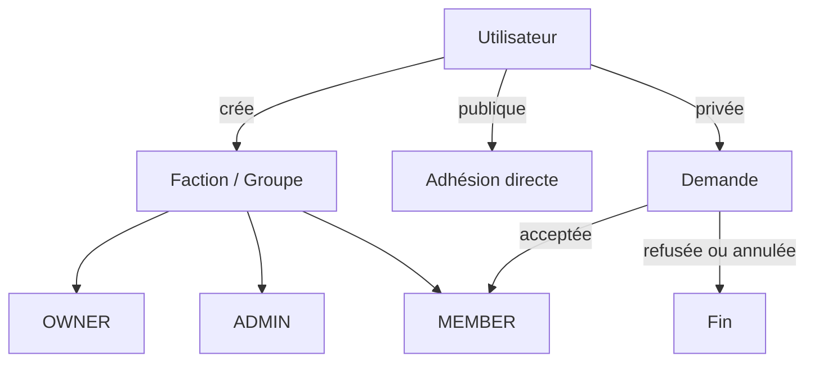

# Factions

Le vocabulaire public « Faction » repose sur l’aggregate Doctrine historique `Groupe`. Aucune entité concurrente n’est introduite.

## Modèle et règles

- `Groupe` : UUID v7, nom, slug serveur stable, description, visibilité `PUBLIC|PRIVATE`, statut `ACTIVE|ARCHIVED`, médias et dates.
- `GroupeMember` : adhésion historisée, statut `ACTIVE|LEFT|REMOVED`, rôle `OWNER|ADMIN|MEMBER`.
- `GroupeJoinRequest` : demande privée `PENDING|ACCEPTED|REJECTED|CANCELLED`.
- Une faction possède exactement un OWNER actif. Il ne peut pas partir avant un transfert ou l’archivage.
- Une contrainte PostgreSQL partielle interdit deux adhésions actives et autorise une réadhésion historisée.
- Une seconde contrainte partielle interdit deux demandes en attente.

## Permissions et sécurité

Le `GroupeVoter` contrôle lecture, édition, archivage, gestion des membres/demandes, transfert, accès et modération du chat. Une faction privée ne livre pas ses détails internes à un non-membre. `ADMIN` gère les membres ordinaires ; seul `OWNER` modifie les rôles d’administration, transfère ou archive. Les rôles globaux `ADMIN` et `MODERATOR` gardent leurs droits de supervision.

## API

- `GET|POST /api/factions`
- `GET|PATCH|DELETE /api/factions/{id}` (`DELETE` archive logiquement)
- `GET /api/factions/{id}/members`
- `POST /api/factions/{id}/join`
- `GET|POST /api/factions/{id}/join-requests`
- `DELETE /api/factions/{id}/join-requests/me`
- `POST /api/factions/{id}/join-requests/{requestId}/accept|reject`
- `POST /api/factions/{id}/leave`
- `DELETE /api/factions/{id}/members/{userId}`
- `PATCH /api/factions/{id}/members/{userId}/role`
- `POST /api/factions/{id}/transfer-ownership`
- `GET /api/users/me/factions`
- `GET /api/factions/{id}/conversation`

La liste utilise `cursor`, `limit`, `search`, `visibility` et `membership=mine`. Les mutations sensibles utilisent des transactions et les violations d’unicité concurrentes deviennent des conflits métier.

## Notifications et audit

Les demandes et décisions, promotions et exclusions réutilisent `Notification`. Archivage, exclusion, rôle et transfert réutilisent `AuditLog`. Les migrations `Version20260806090000` puis `Version20260825130000` créent et renforcent le schéma sans modifier une migration déjà livrée.
