# Documentation Technique — GemLink

> **Rôles :** Visiteur · User · Client · Modérateur · Administrateur 
> **Outil de rendu :** GitHub, et [Mermaid Live](https://mermaid.live)

---

## Table des matières

1. [Personas et Mapping des pages](#1-personas-et-mapping-des-pages)
2. [Diagramme en couches](#2-diagramme-en-couches)
3. [Diagrammes de cas d'utilisation (Use Case)](#3-diagrammes-de-cas-dutilisation-use-case)
4. [MCD — Modèle Conceptuel de Données](#4-mcd--modèle-conceptuel-de-données)
5. [MLD — Modèle Logique de Données](#5-mld--modèle-logique-de-données)
6. [Diagramme de Classes](#6-diagramme-de-classes)
7. [Diagrammes de Séquence](#7-diagrammes-de-séquence)
8. [Diagramme de Composants](#8-diagramme-de-composants)
9. [Matrice des Rôles et Fonctionnalités](#9-matrice-des-rôles-et-fonctionnalités)

---

## 1. Personas et Mapping des pages

### Définition des rôles

| Rôle               | Description                                                                                                                                                                                                                                                   |
| ------------------ | ------------------------------------------------------------------------------------------------------------------------------------------------------------------------------------------------------------------------------------------------------------- |
| **Visiteur**       | Utilisateur non authentifié. Accès lecture seule aux contenus publics.                                                                                                                                                                                        |
| **User**           | Utilisateur inscrit et authentifié. Accès aux fonctionnalités sociales et de reconnaissance.                                                                                                                                                                  |
| **Client**         | Professionnel (bijoutier, musée, revendeur…) disposant d'un espace de gestion de sa propre galerie et vitrine. Il gère ses propres utilisateurs (sa clientèle), ses collections et sa facturation. N'a pas accès à l'administration globale de la plateforme. |
| **Modérateur**     | Rôle attribué à un `User` par un Administrateur. Donne accès à un périmètre limité d'outils d'administration : modération des posts, commentaires et résultats de reconnaissance. Ne remplace pas l'Admin.                                                    |
| **Administrateur** | Accès complet à l'ensemble de la plateforme. Gère tous les utilisateurs, contenus, paramètres IA, gamification, facturation et infrastructure.                                                                                                                |

---

### Mapping des pages par rôle

> Les pages en **gras** sont les features clés prioritaires pour la soutenance.

#### Tous les rôles (Visiteur inclus)
- Login / Logout / Mot de passe oublié
- **Galerie** (feed public)
- HomePage

#### User
- Inscription / Profil
- Badges · Notifications · Historique
- Likes · Commentaires · Partage
- Suivre des utilisateurs · Abonnements
- **Identifier une Pierre**
- **Créer / gérer un Post**
- **Collections (Vitrines)**
- **Recherche de similarité**
- **Tags et catégories**
- **Gamification** (points, niveaux, leaderboard)
- Trust Score (consultation)
- Groupes

#### Client
- Dashboard Client
- Statistiques de sa galerie
- Mailing vers sa clientèle
- Gestion de ses utilisateurs (sa clientèle)
- **Gestion de sa Galerie et de sa Vitrine**
- **Gestion de ses Collections**
- **Gestion de ses Posts**
- **Gestion de ses Tags et catégories**
- Création de badges personnalisés
- **Facturation**

#### Modérateur *(rôle attribué à un User)*
- Dashboard de modération
- **Modération des Posts** (signalements, masquage, suppression)
- **Modération des Commentaires**
- **Modération des résultats de reconnaissance** (correction des identifications IA signalées)

#### Administrateur
- Dashboard Admin · Statistiques globales
- Gestion de tous les utilisateurs
- **Gestion des Galeries et Vitrines**
- **Gestion des Collections**
- **Gestion des Posts**
- **Gestion des Tags et catégories**
- **Gestion de la modération** (signalements, ban, suspension)
- **Gestion de la Gamification** (barèmes, niveaux, badges)
- **Gestion du Trust Score** (seuils)
- **Gestion des Groupes**
- **Facturation globale**
- **Messagerie interne**
- **Gestion de la publicité et des contenus sponsorisés**
- **Sécurité** (rate limiting, blocklist, audit logs)
- Gestion de l'API (clés, quotas)
- **Reports, ban, suspension**
- **Dashboard ticketing**
- **Mailer / Newsletter**
- **Gestion des partenariats**
- **CMS** (pages statiques, FAQ)
- Gestion des modèles IA (versioning, fine-tuning, rollback)

---

## 2. Diagramme en couches

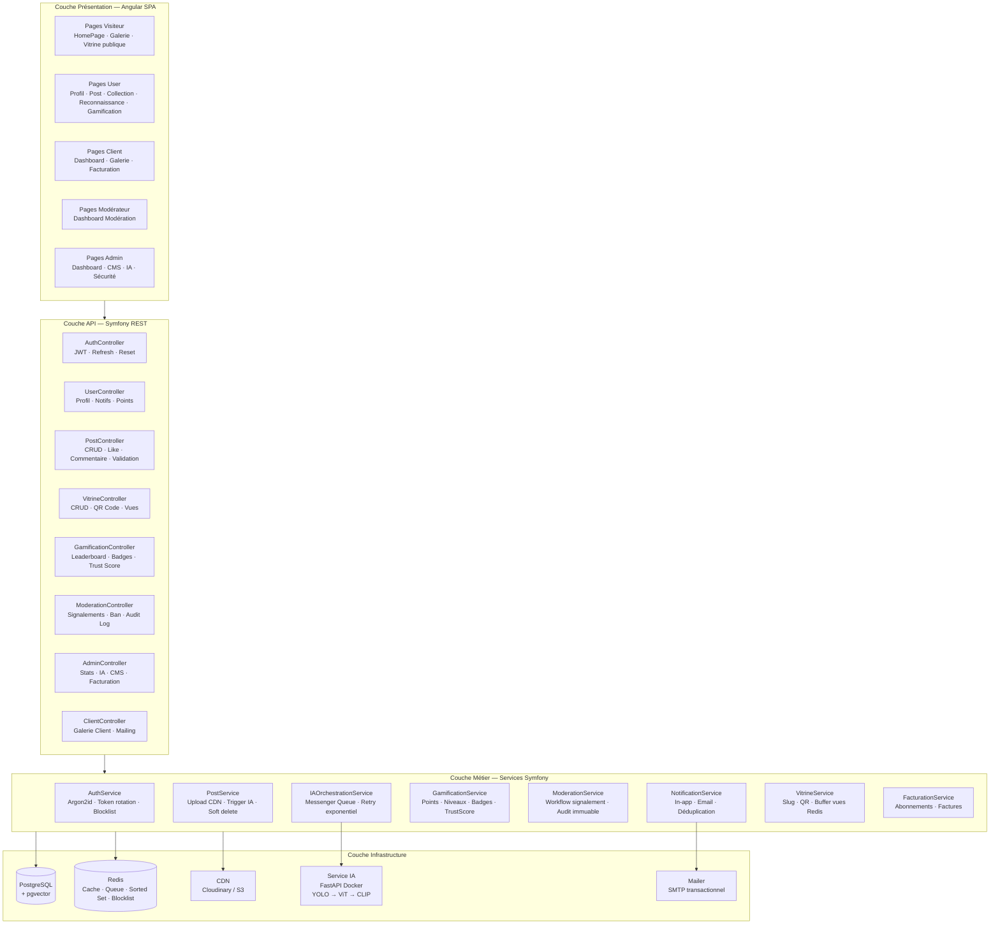

---

## 3. Diagrammes de cas d'utilisation (Use Case)

### UC-1 — Authentification et Profil

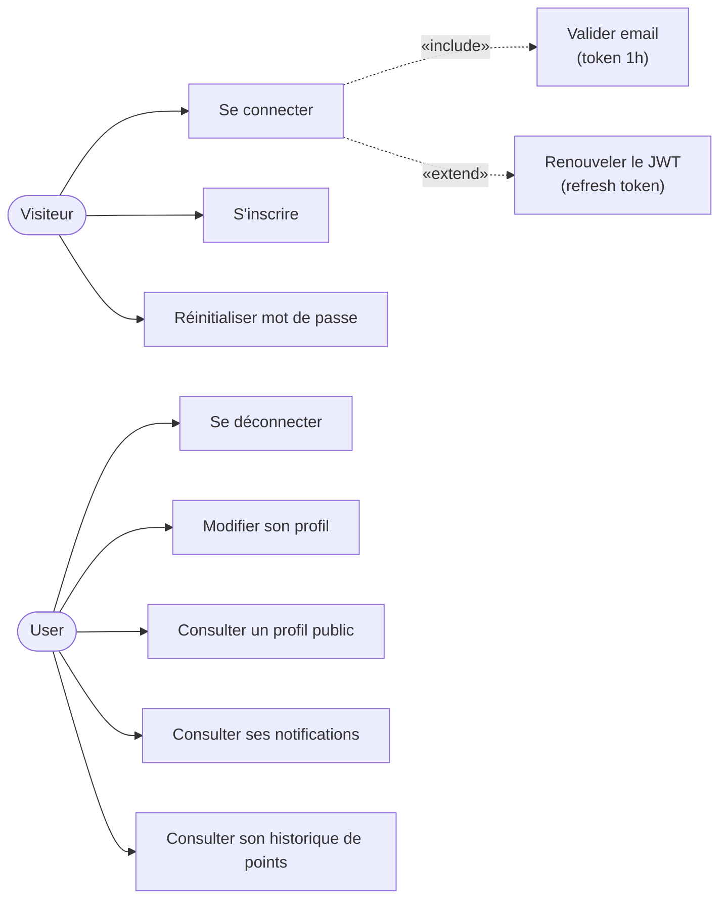

---

### UC-2 — Réseau social (User)

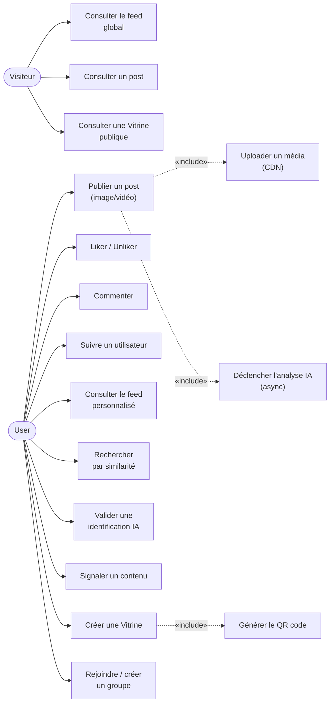

---

### UC-3 — Reconnaissance IA (User + Plateforme)

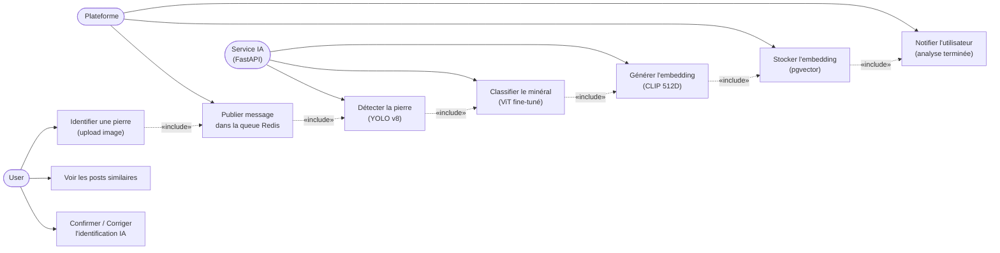

---

### UC-4 — Client

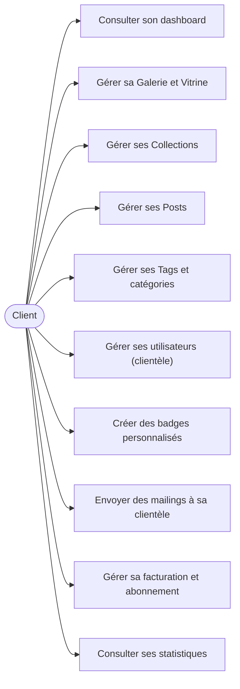

---

### UC-5 — Modérateur

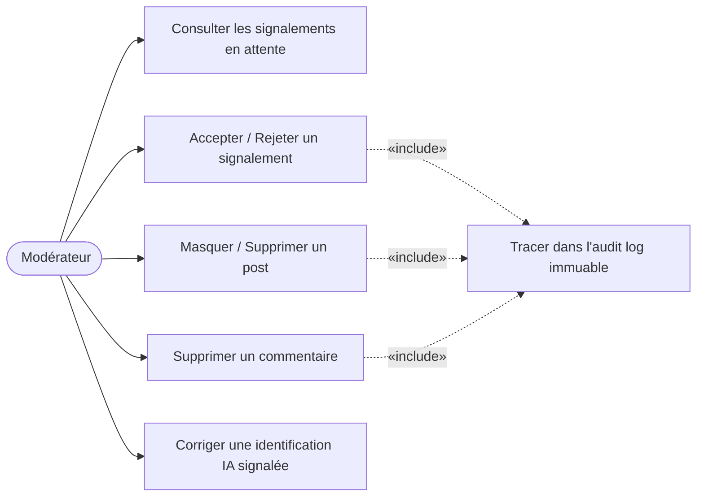

---

### UC-6 — Administrateur

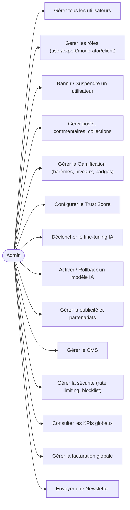

---

### 4. MCD — Modèle Conceptuel de Données

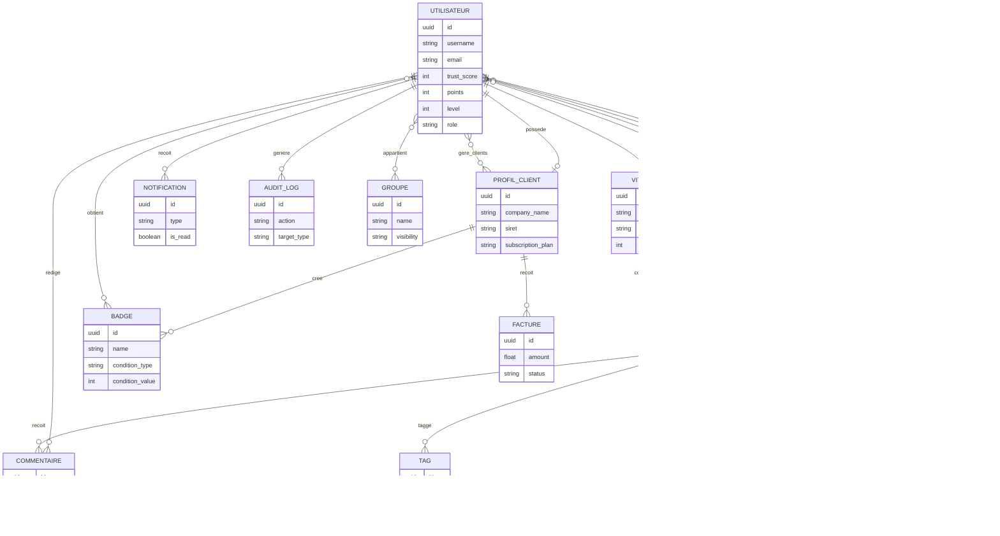
---

## 5. MLD — Modèle Logique de Données

```mermaid
erDiagram

 USER {
 uuid id PK
 string username
 string email
 string password_hash
 string avatar_url
 string bio
 int trust_score
 string role
 int points
 int level
 string status
 timestamp created_at
 }

 CLIENT_PROFILE {
 uuid id PK
 uuid user_id FK
 string company_name
 string siret
 string address
 string subscription_plan
 timestamp subscription_expires_at
 timestamp created_at
 }

 CLIENT_CUSTOMER {
 uuid client_id FK
 uuid customer_user_id FK
 timestamp created_at
 }

 POST {
 uuid id PK
 uuid user_id FK
 uuid stone_id FK
 string title
 string description
 string media_url
 string media_type
 string status
 boolean is_sponsored
 timestamp created_at
 timestamp deleted_at
 }

 COMMENT {
 uuid id PK
 uuid post_id FK
 uuid user_id FK
 string content
 timestamp created_at
 timestamp deleted_at
 }

 LIKE {
 uuid id PK
 uuid post_id FK
 uuid user_id FK
 timestamp created_at
 }

 TAG {
 uuid id PK
 uuid owner_id FK
 string name
 string scope
 }

 POST_TAG {
 uuid post_id FK
 uuid tag_id FK
 }

 STONE {
 uuid id PK
 string name
 string category
 float hardness
 string crystal_system
 string composition
 string description
 }

 EMBEDDING {
 uuid id PK
 uuid post_id FK
 uuid model_version_id FK
 vector vector_data
 timestamp created_at
 }

 VALIDATION {
 uuid id PK
 uuid post_id FK
 uuid user_id FK
 string action
 string proposed_label
 int trust_score_snapshot
 timestamp created_at
 }

 VITRINE {
 uuid id PK
 uuid user_id FK
 string title
 string description
 string slug
 string qr_code_url
 int view_count
 boolean is_sponsored
 timestamp created_at
 }

 VITRINE_ITEM {
 uuid id PK
 uuid vitrine_id FK
 uuid post_id FK
 int position
 }

 BADGE {
 uuid id PK
 uuid created_by FK
 string name
 string description
 string icon_url
 string condition_type
 int condition_value
 boolean is_custom
 }

 USER_BADGE {
 uuid user_id FK
 uuid badge_id FK
 timestamp earned_at
 }

 REPORT {
 uuid id PK
 uuid post_id FK
 uuid reporter_id FK
 string reason_type
 string description
 string status
 timestamp created_at
 }

 NOTIFICATION {
 uuid id PK
 uuid user_id FK
 string type
 string content
 boolean is_read
 timestamp created_at
 }

 POINT_TRANSACTION {
 uuid id PK
 uuid user_id FK
 string action_type
 int amount
 timestamp created_at
 }

 REFRESH_TOKEN {
 uuid id PK
 uuid user_id FK
 string token_hash
 timestamp expires_at
 timestamp revoked_at
 timestamp created_at
 }

 AI_MODEL_VERSION {
 uuid id PK
 string name
 string model_type
 float accuracy
 float f1_score
 string status
 timestamp created_at
 }

 FINE_TUNE_JOB {
 uuid id PK
 uuid model_version_id FK
 int min_trust_score
 string status
 int progress
 string logs
 timestamp created_at
 }

 AUDIT_LOG {
 uuid id PK
 uuid actor_id FK
 string action
 string target_type
 uuid target_id
 string reason
 timestamp created_at
 }

 GROUP_ENTITY {
 uuid id PK
 uuid owner_id FK
 string name
 string description
 string visibility
 timestamp created_at
 }

 GROUP_MEMBER {
 uuid group_id FK
 uuid user_id FK
 string role
 timestamp joined_at
 }

 INVOICE {
 uuid id PK
 uuid client_id FK
 float amount
 string status
 timestamp issued_at
 timestamp paid_at
 }

 FOLLOW {
 uuid follower_id FK
 uuid followed_id FK
 timestamp created_at
 }

 %% ── RELATIONS ─────────────────────────────────────────────────

 USER ||--o{ POST : "publie"
 USER ||--o{ COMMENT : "rédige"
 USER ||--o{ LIKE : "effectue"
 USER ||--o{ VALIDATION : "soumet"
 USER ||--o{ VITRINE : "crée"
 USER ||--o{ USER_BADGE : "reçoit"
 USER ||--o{ REPORT : "signale"
 USER ||--o{ NOTIFICATION : "reçoit"
 USER ||--o{ POINT_TRANSACTION : "accumule"
 USER ||--o{ REFRESH_TOKEN : "possède"
 USER ||--o{ AUDIT_LOG : "génère"
 USER ||--o{ GROUP_MEMBER : "rejoint"
 USER ||--o{ FOLLOW : "suit (follower)"
 USER ||--o{ FOLLOW : "est suivi (followed)"
 USER ||--o| CLIENT_PROFILE : "possède"

 CLIENT_PROFILE ||--o{ CLIENT_CUSTOMER : "gère"
 CLIENT_CUSTOMER }o--o| USER : "est client de"

 CLIENT_PROFILE ||--o{ INVOICE : "reçoit"
 CLIENT_PROFILE ||--o{ BADGE : "crée"

 POST ||--o{ COMMENT : "reçoit"
 POST ||--o{ LIKE : "reçoit"
 POST ||--o{ VALIDATION : "reçoit"
 POST ||--o{ REPORT : "fait l'objet de"
 POST ||--o{ VITRINE_ITEM : "référencé dans"
 POST ||--o{ POST_TAG : "taggué par"
 POST ||--o| EMBEDDING : "génère"
 POST }o--o| STONE : "identifié comme"

 TAG ||--o{ POST_TAG : "associé à"
 VITRINE ||--o{ VITRINE_ITEM : "contient"
 BADGE ||--o{ USER_BADGE : "attribué via"

 AI_MODEL_VERSION ||--o{ EMBEDDING : "produit"
 AI_MODEL_VERSION ||--o{ FINE_TUNE_JOB : "versionnée par"

 GROUP_ENTITY ||--o{ GROUP_MEMBER : "compose"
```

---

**Note technique — Soft Delete vs ON DELETE CASCADE**

Le MLD contient des champs `deleted_at` (soft delete) sur `POST` et `COMMENT`. Attention : une mise à jour de `deleted_at` n'active pas les contraintes `ON DELETE CASCADE` au niveau SQL. Options recommandées :

- Conserver le *soft delete* et implémenter la cascade explicitement dans la couche métier (ex. `PostService::softDelete()` qui marque `deleted_at` et met à jour/supprime les entités associées). Une purge physique asynchrone peut être planifiée si nécessaire.
- Utiliser des `DELETE` physiques lorsque la politique de rétention/RGPD le permet afin de bénéficier des `ON DELETE CASCADE` en base.
- Mettre en place des *triggers* SQL ou procédures stockées pour propager un soft delete si vous préférez centraliser la logique en base.

Voir `doc/bdd.md` pour des exemples de mise en œuvre (pseudocode Symfony, SQL de migration HNSW, scripts de purge).

## 6. Diagramme de Classes

```mermaid
classDiagram

 class TimestampableTrait {
 <<trait>>
 +DateTime createdAt
 +DateTime updatedAt
 }

 class SoftDeletableTrait {
 <<trait>>
 +DateTime deletedAt
 +softDelete() void
 +isDeleted() bool
 +restore() void
 }

 class UserInterface {
 <<interface>>
 +getId() Uuid
 +getEmail() string
 +getRoles() array
 +eraseCredentials() void
 }

 class User {
 -Uuid id
 -string username
 -string email
 -string passwordHash
 -string avatarUrl
 -string bio
 -int trustScore
 -UserRole role
 -int points
 -int level
 -UserStatus status
 +getRoles() array
 +getTrustScore() int
 +updateTrustScore(confirmed int, total int) void
 +addPoints(amount int, action PointActionType) void
 +elevateRole(newRole UserRole) void
 +ban() void
 +unban() void
 +isActive() bool
 +isModerator() bool
 +isAdmin() bool
 +isClient() bool
 }

 class ClientProfile {
 -Uuid id
 -string companyName
 -string siret
 -string address
 -string subscriptionPlan
 -DateTime subscriptionExpiresAt
 +isSubscriptionActive() bool
 +getInvoices() Collection
 }

 class Post {
 -Uuid id
 -string title
 -string description
 -string mediaUrl
 -MediaType mediaType
 -PostStatus status
 -bool isSponsored
 -DateTime deletedAt
 +setStatus(status PostStatus) void
 +isAnalyzed() bool
 +isPendingAnalysis() bool
 +softDelete() void
 +getLikesCount() int
 +getCommentsCount() int
 }

 class Comment {
 -Uuid id
 -string content
 -DateTime deletedAt
 +softDelete() void
 +isDeleted() bool
 }

 class Like {
 -Uuid id
 -DateTime createdAt
 }

 class Tag {
 -Uuid id
 -string name
 -TagScope scope
 }

 class Stone {
 -Uuid id
 -string name
 -string category
 -float hardness
 -string crystalSystem
 -string composition
 }

 class Embedding {
 -Uuid id
 -array vectorData
 -DateTime createdAt
 +computeCosineSimilarity(other Embedding) float
 }

 class Validation {
 -Uuid id
 -ValidationAction action
 -string proposedLabel
 -int trustScoreSnapshot
 +getWeightedContribution() float
 +isConfirmation() bool
 }

 class Vitrine {
 -Uuid id
 -string title
 -string description
 -string slug
 -string qrCodeUrl
 -int viewCount
 -bool isSponsored
 +generateSlug(title string) string
 +incrementViewCount() void
 +getItemsSortedByPosition() Collection
 +isEmpty() bool
 }

 class VitrineItem {
 -Uuid id
 -int position
 +setPosition(pos int) void
 }

 class Badge {
 -Uuid id
 -string name
 -string description
 -ConditionType conditionType
 -int conditionValue
 -bool isCustom
 +isSatisfiedBy(user User) bool
 }

 class Report {
 -Uuid id
 -ReportReason reasonType
 -string description
 -ReportStatus status
 +accept() void
 +reject() void
 +isPending() bool
 }

 class Notification {
 -Uuid id
 -string type
 -string content
 -bool isRead
 +markAsRead() void
 }

 class PointTransaction {
 -Uuid id
 -PointActionType actionType
 -int amount
 }

 class RefreshToken {
 -Uuid id
 -string tokenHash
 -DateTime expiresAt
 -DateTime revokedAt
 +isValid() bool
 +isExpired() bool
 +revoke() void
 }

 class AiModelVersion {
 -Uuid id
 -string name
 -ModelType modelType
 -float accuracy
 -float f1Score
 -ModelStatus status
 +activate() void
 +deprecate() void
 +getPerformanceScore() float
 }

 class FineTuneJob {
 -Uuid id
 -int minTrustScore
 -JobStatus status
 -int progress
 -string logs
 +updateProgress(pct int) void
 +complete() void
 +fail(error string) void
 }

 class AuditLog {
 -Uuid id
 -string action
 -string targetType
 -Uuid targetId
 -string reason
 -DateTime createdAt
 }

 class Group {
 -Uuid id
 -string name
 -string description
 -GroupVisibility visibility
 +addMember(user User, role string) void
 +removeMember(user User) void
 +isPublic() bool
 }

 class Invoice {
 -Uuid id
 -float amount
 -InvoiceStatus status
 -DateTime issuedAt
 -DateTime paidAt
 +markAsPaid() void
 +cancel() void
 +isPaid() bool
 }

 %% Enums
 class UserRole {
 <<enumeration>>
 USER
 EXPERT
 MODERATOR
 CLIENT
 ADMIN
 }

 class UserStatus {
 <<enumeration>>
 PENDING_VALIDATION
 ACTIVE
 BANNED
 }

 class PostStatus {
 <<enumeration>>
 PENDING_ANALYSIS
 ANALYZED
 ANALYSIS_FAILED
 AUTO_HIDDEN
 PUBLISHED
 }

 class MediaType {
 <<enumeration>>
 IMAGE
 VIDEO
 }

 class ValidationAction {
 <<enumeration>>
 CONFIRM
 CORRECT
 REJECT
 }

 class ReportReason {
 <<enumeration>>
 INAPPROPRIATE_CONTENT
 WRONG_IDENTIFICATION
 SPAM
 HARASSMENT
 }

 class ReportStatus {
 <<enumeration>>
 PENDING
 ACCEPTED
 REJECTED
 }

 class ConditionType {
 <<enumeration>>
 POST_COUNT
 VALIDATION_COUNT
 TRUST_SCORE_THRESHOLD
 LEVEL_REACHED
 }

 class PointActionType {
 <<enumeration>>
 POST_PUBLISHED
 LIKE_RECEIVED
 VALIDATION_SUBMITTED
 VALIDATION_CONFIRMED
 }

 class ModelType {
 <<enumeration>>
 YOLO
 VIT
 CLIP
 }

 class ModelStatus {
 <<enumeration>>
 TRAINING
 ACTIVE
 DEPRECATED
 }

 class JobStatus {
 <<enumeration>>
 PENDING
 RUNNING
 COMPLETED
 FAILED
 }

 class TagScope {
 <<enumeration>>
 GLOBAL
 CLIENT
 USER
 }

 class GroupVisibility {
 <<enumeration>>
 PUBLIC
 PRIVATE
 }

 class InvoiceStatus {
 <<enumeration>>
 PENDING
 PAID
 CANCELLED
 }

 %% Implémentations
 User ..|> UserInterface
 User ..> TimestampableTrait
 Post ..> TimestampableTrait
 Post ..> SoftDeletableTrait
 Comment ..> TimestampableTrait
 Comment ..> SoftDeletableTrait
 AuditLog ..> TimestampableTrait

 %% Enums
 User ..> UserRole
 User ..> UserStatus
 Post ..> PostStatus
 Post ..> MediaType
 Validation ..> ValidationAction
 Report ..> ReportReason
 Report ..> ReportStatus
 Badge ..> ConditionType
 PointTransaction ..> PointActionType
 AiModelVersion ..> ModelType
 AiModelVersion ..> ModelStatus
 FineTuneJob ..> JobStatus
 Tag ..> TagScope
 Group ..> GroupVisibility
 Invoice ..> InvoiceStatus

 %% Associations
 User "1" o-- "0..*" Post : publie
 User "1" o-- "0..*" Comment : rédige
 User "1" o-- "0..*" Like : effectue
 User "1" o-- "0..*" Validation : soumet
 User "1" o-- "0..*" Vitrine : crée
 User "1" o-- "0..*" Badge : reçoit
 User "1" o-- "0..*" Report : signale
 User "1" o-- "0..*" Notification : reçoit
 User "1" o-- "0..*" PointTransaction : accumule
 User "1" o-- "0..*" RefreshToken : possède
 User "1" o-- "0..*" AuditLog : génère
 User "1" o-- "0..1" ClientProfile : possède
 User "0..*" o-- "0..*" Group : rejoint

 ClientProfile "1" o-- "0..*" Invoice : reçoit
 ClientProfile "1" o-- "0..*" Badge : crée

 Post "1" o-- "0..*" Comment : reçoit
 Post "1" o-- "0..*" Like : reçoit
 Post "1" o-- "0..*" Validation : reçoit
 Post "1" o-- "0..*" Report : reçoit
 Post "1" o-- "0..1" Embedding : génère
 Post "0..*" o-- "0..1" Stone : identifié comme
 Post "0..*" o-- "0..*" Tag : taggué par

 Vitrine "1" *-- "0..*" VitrineItem : contient
 Post "1" o-- "0..*" VitrineItem : référencé par

 AiModelVersion "1" o-- "0..*" Embedding : produit
 AiModelVersion "1" o-- "0..*" FineTuneJob : versionnée par
```

---

## 7. Diagrammes de Séquence

### SEQ-1 — Inscription et validation email

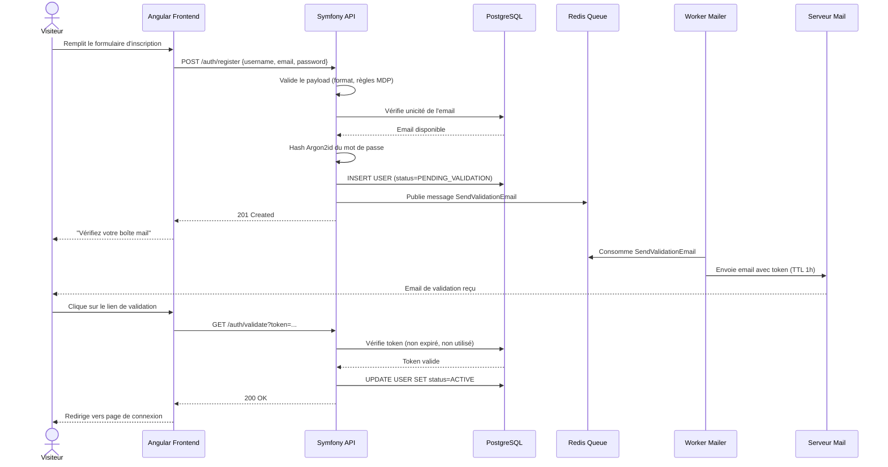

---

### SEQ-2 — Connexion et renouvellement JWT

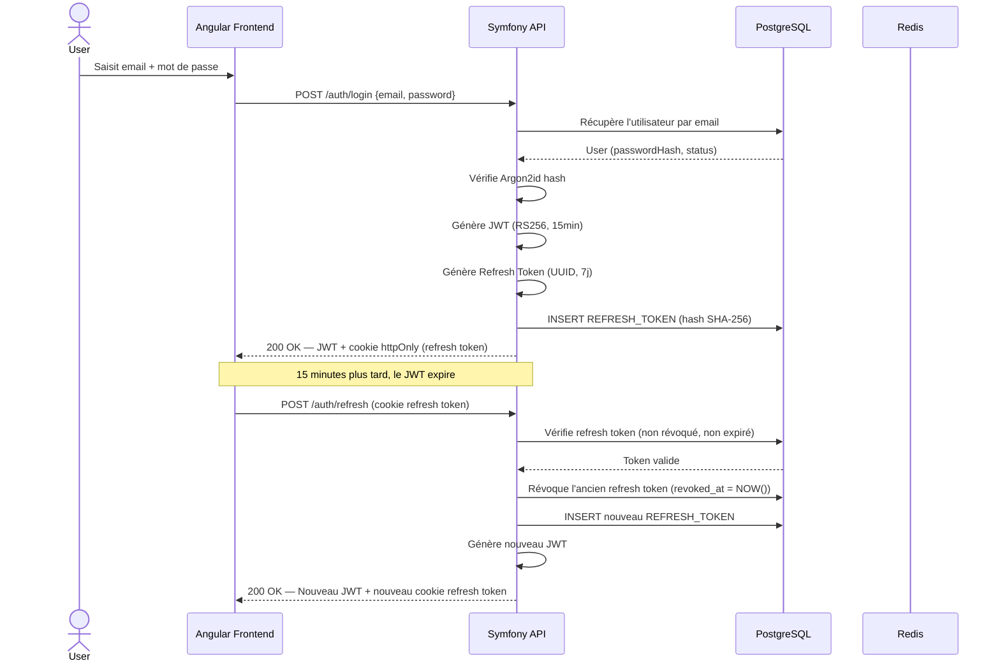

---

### SEQ-3 — Publication d'un post et analyse IA asynchrone

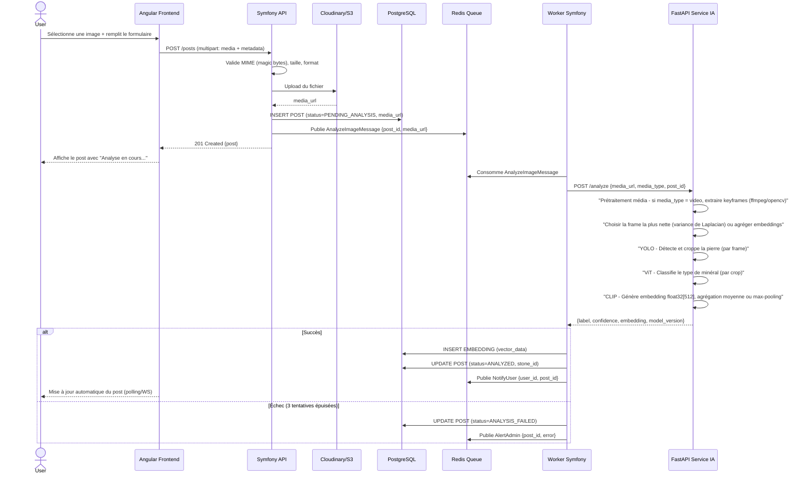

---

### SEQ-4 — Signalement et traitement par le modérateur

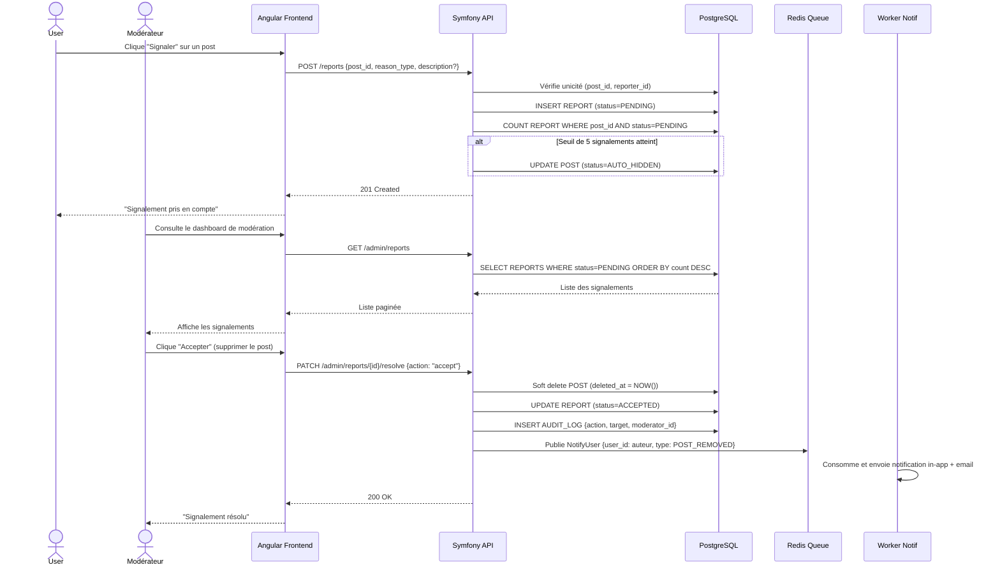

---

### SEQ-5 — Attribution de points et de badge

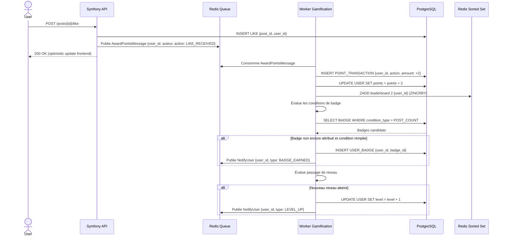

---

## 8. Diagramme de Composants

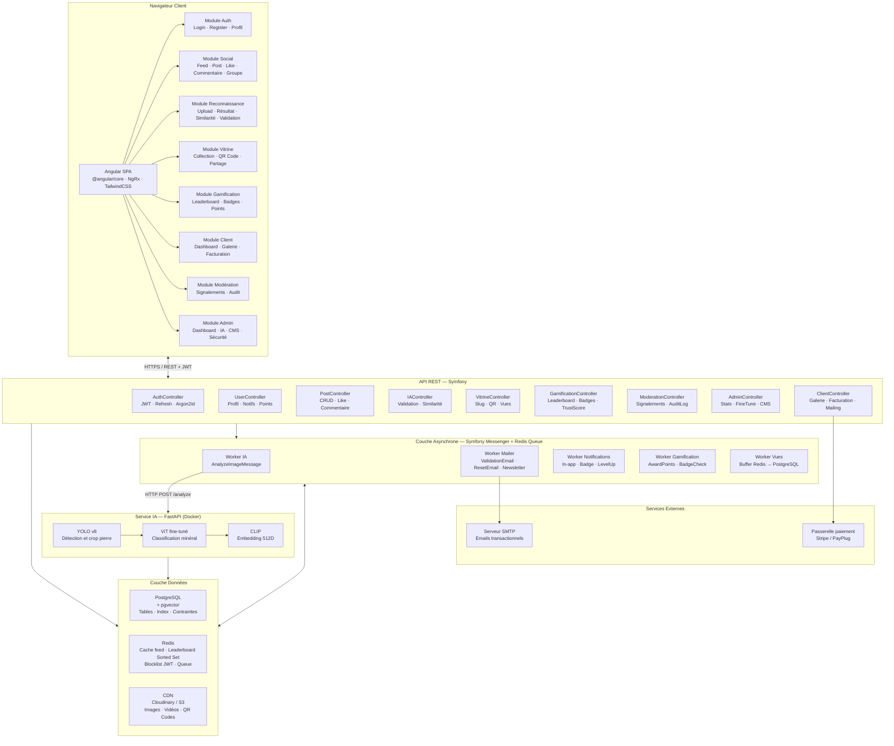

---

## 9. Matrice des Rôles et Fonctionnalités

> o = accès · x = aucun accès

### Fonctionnalités publiques et sociales

| Fonctionnalité                     | Visiteur | User  | Client | Modérateur | Admin |
| ---------------------------------- | :------: | :---: | :----: | :--------: | :---: |
| Consulter le feed global / Galerie |    o     |   o   |   o    |     o      |   o   |
| Consulter une Vitrine publique     |    o     |   o   |   o    |     o      |   o   |
| Consulter un profil public         |    o     |   o   |   o    |     o      |   o   |
| S'inscrire                         |    o     |   x   |   x    |     x      |   x   |
| Se connecter / Déconnexion         |    o     |   o   |   o    |     o      |   o   |
| Réinitialiser son mot de passe     |    o     |   o   |   o    |     o      |   o   |
| Modifier son profil                |    x     |   o   |   o    |     o      |   o   |
| Consulter ses notifications        |    x     |   o   |   o    |     o      |   o   |

### Posts et interactions

| Fonctionnalité            | Visiteur | User  | Client | Modérateur | Admin |
| ------------------------- | :------: | :---: | :----: | :--------: | :---: |
| Publier un post           |    x     |   o   |   o    |     o      |   o   |
| Modifier son propre post  |    x     |   o   |   o    |     o      |   o   |
| Supprimer son propre post |    x     |   o   |   o    |     o      |   o   |
| Liker / Unliker un post   |    x     |   o   |   o    |     o      |   o   |
| Commenter un post         |    x     |   o   |   o    |     o      |   o   |
| Supprimer son commentaire |    x     |   o   |   o    |     o      |   o   |
| Suivre un utilisateur     |    x     |   o   |   o    |     o      |   o   |
| Signaler un contenu       |    x     |   o   |   o    |     o      |   o   |

### Reconnaissance IA et similarité

| Fonctionnalité                        | Visiteur | User  | Client | Modérateur | Admin |
| ------------------------------------- | :------: | :---: | :----: | :--------: | :---: |
| Identifier une pierre (upload)        |    x     |   o   |   o    |     o      |   o   |
| Voir le résultat IA d'un post         |    o     |   o   |   o    |     o      |   o   |
| Voir les posts similaires             |    o     |   o   |   o    |     o      |   o   |
| Valider / Corriger une identification |    x     |   o   |   o    |     o      |   o   |
| Contribuer au dataset fine-tuning     |    x     |   o   |   o    |     o      |   o   |
| Déclencher un cycle de fine-tuning    |    x     |   x   |   x    |     x      |   o   |
| Gérer les versions de modèles IA      |    x     |   x   |   x    |     x      |   o   |
| Corriger une identification signalée  |    x     |   x   |   x    |     o      |   o   |

### Collections (Vitrines)

| Fonctionnalité            | Visiteur | User  | Client | Modérateur | Admin |
| ------------------------- | :------: | :---: | :----: | :--------: | :---: |
| Créer une Vitrine         |    x     |   o   |   o    |     o      |   o   |
| Gérer sa propre Vitrine   |    x     |   o   |   o    |     o      |   o   |
| Gérer toutes les Vitrines |    x     |   x   |   x    |     x      |   o   |
| Télécharger le QR code    |    x     |   o   |   o    |     o      |   o   |
| Voir le compteur de vues  |    x     |   o   |   o    |     o      |   o   |

### Gamification et Trust Score

| Fonctionnalité                    | Visiteur | User  | Client | Modérateur | Admin |
| --------------------------------- | :------: | :---: | :----: | :--------: | :---: |
| Gagner des points                 |    x     |   o   |   o    |     o      |   o   |
| Progresser en niveaux             |    x     |   o   |   o    |     o      |   o   |
| Recevoir des badges               |    x     |   o   |   o    |     o      |   o   |
| Créer des badges personnalisés    |    x     |   x   |   o    |     x      |   o   |
| Consulter le leaderboard          |    o     |   o   |   o    |     o      |   o   |
| Consulter son Trust Score         |    x     |   o   |   o    |     o      |   o   |
| Configurer les seuils Trust Score |    x     |   x   |   x    |     x      |   o   |
| Modifier les barèmes de points    |    x     |   x   |   x    |     x      |   o   |

### Groupes

| Fonctionnalité                | Visiteur | User  | Client | Modérateur | Admin |
| ----------------------------- | :------: | :---: | :----: | :--------: | :---: |
| Consulter les groupes publics |    o     |   o   |   o    |     o      |   o   |
| Créer / Rejoindre un groupe   |    x     |   o   |   o    |     o      |   o   |
| Gérer son groupe              |    x     |   o   |   o    |     o      |   o   |
| Gérer tous les groupes        |    x     |   x   |   x    |     x      |   o   |

### Modération

| Fonctionnalité                    | Visiteur | User  | Client | Modérateur | Admin |
| --------------------------------- | :------: | :---: | :----: | :--------: | :---: |
| Voir les signalements en attente  |    x     |   x   |   x    |     o      |   o   |
| Traiter un signalement            |    x     |   x   |   x    |     o      |   o   |
| Masquer / Supprimer tout post     |    x     |   x   |   x    |     o      |   o   |
| Supprimer tout commentaire        |    x     |   x   |   x    |     o      |   o   |
| Consulter l'audit log             |    x     |   x   |   x    |     o      |   o   |
| Bannir / Suspendre un utilisateur |    x     |   x   |   x    |     x      |   o   |
| Gérer les reports / tickets       |    x     |   x   |   x    |     o      |   o   |

### Espace Client

| Fonctionnalité                     | Visiteur | User  | Client | Modérateur | Admin |
| ---------------------------------- | :------: | :---: | :----: | :--------: | :---: |
| Accéder au dashboard Client        |    x     |   x   |   o    |     x      |   o   |
| Gérer sa Galerie / Vitrine Client  |    x     |   x   |   o    |     x      |   o   |
| Gérer ses posts et collections     |    x     |   x   |   o    |     x      |   o   |
| Gérer ses tags et catégories       |    x     |   x   |   o    |     x      |   o   |
| Gérer ses utilisateurs (clientèle) |    x     |   x   |   o    |     x      |   o   |
| Envoyer un mailing à sa clientèle  |    x     |   x   |   o    |     x      |   o   |
| Consulter ses statistiques         |    x     |   x   |   o    |     x      |   o   |
| Gérer sa facturation               |    x     |   x   |   o    |     x      |   o   |

### Administration globale

| Fonctionnalité                    | Visiteur | User  | Client | Modérateur | Admin |
| --------------------------------- | :------: | :---: | :----: | :--------: | :---: |
| Dashboard Admin + KPIs globaux    |    x     |   x   |   x    |     x      |   o   |
| Gérer tous les utilisateurs       |    x     |   x   |   x    |     x      |   o   |
| Gérer les rôles                   |    x     |   x   |   x    |     x      |   o   |
| Gérer la facturation globale      |    x     |   x   |   x    |     x      |   o   |
| Gérer la publicité / sponsoring   |    x     |   x   |   x    |     x      |   o   |
| Gérer les partenariats            |    x     |   x   |   x    |     x      |   o   |
| Gérer le CMS                      |    x     |   x   |   x    |     x      |   o   |
| Envoyer la Newsletter             |    x     |   x   |   x    |     x      |   o   |
| Gérer la messagerie interne       |    x     |   x   |   x    |     x      |   o   |
| Gérer la sécurité (rate limiting) |    x     |   x   |   x    |     x      |   o   |
| Gérer l'API (clés, quotas)        |    x     |   x   |   x    |     x      |   o   |
| Dashboard ticketing               |    x     |   x   |   x    |     o      |   o   |